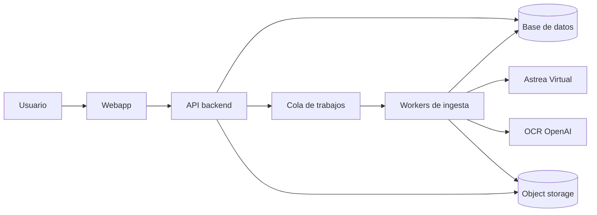

# Arquitectura recomendada

La arquitectura recomendada separa la webapp, la API, los workers de ingesta y el almacenamiento. Esa separación es CLAVE: una extracción de libro completo no puede vivir dentro de una request HTTP.

## Vista general

## Componentes

| Componente | Responsabilidad |
| --- | --- |
| Webapp | Login, solicitud de libros, estado de jobs, descargas |
| API backend | Reglas de negocio, permisos, contratos HTTP |
| Base de datos | Metadata, páginas, jobs, usuarios, auditoría |
| Cola de trabajos | Ejecutar ingestas fuera del ciclo HTTP |
| Worker de ingesta | Navegación/captura, OCR, reintentos, persistencia |
| Object storage | Archivos pesados: imágenes, PDFs, exports |
| OCR | Extracción textual desde páginas capturadas |

## Decisiones iniciales

| Área | Decisión |
| --- | --- |
| Procesamiento | Asincrónico con jobs |
| Persistencia | DB para metadata/texto, storage para binarios |
| OCR | OpenAI como proveedor inicial |
| Descarga | Export generado desde datos persistidos |
| Errores | Permitir resultados parciales y reintentos por página |
| UI | Mostrar progreso y diagnóstico, no bloquear al usuario |

## Por qué no hacer todo en la web request

Porque descargar un libro completo puede tardar minutos, fallar parcialmente, necesitar retries y consumir recursos externos. Si lo metemos dentro de una request:

- se cortan conexiones;
- se pierden errores;
- no hay reanudación limpia;
- escala mal;
- el usuario queda atado a una pantalla abierta.

El worker es el albañil. La API es el arquitecto que recibe el pedido, registra el plano y manda el trabajo a ejecutar. Mezclar esas responsabilidades es construir sobre barro.

## Recomendación técnica inicial

Mantener el backend modular:

- `books`: catálogo y metadata;
- `ingestion`: jobs, estados y workers;
- `pages`: páginas capturadas y texto;
- `exports`: generación de archivos descargables;
- `users`: autenticación, permisos y auditoría.

